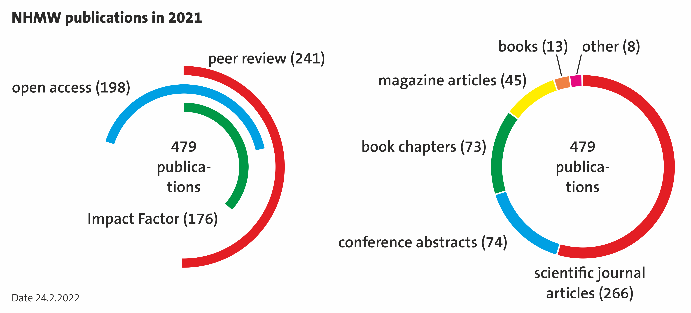

# Open Science in Museums - Strategy of the Naturhistorisches Museum Wien (NHMW)    *- the benefits of openness*

#### **Authors:** 
*<a href="https://orcid.org/0000-0002-7214-7015">
Vohland, Katrin </a>;
<a href="https://orcid.org/0000-0002-5827-0797">
Eichert, Stefan </a>;
Fiedler, Sarah;
<a href="https://orcid.org/0000-0002-3810-0504">
Kapun, Martin </a>;
<a href="https://orcid.org/0000-0002-8566-8848">
Kroh, Andreas </a>;
<a href="https://orcid.org/0000-0003-0564-4617">
Mehu-Blantar, Ines </a>;
Ott, Iris;
<a href="https://orcid.org/0000-0002-5963-349X">
Rainer, Heimo </a>;
<a href="https://orcid.org/0000-0002-1373-456X">
Schwentner, Martin </a>;
Zimmermann, Eva;*

 
Please cite this document as follows:
 

> *Vohland, Katrin; Eichert, Stefan; Fiedler, Sarah;
> Kapun, Martin; Kroh, Andreas; Mehu-Blantar, Ines; 
> Ott, Iris ; Rainer, Heimo; Schwentner, Martin;
> Zimmermann, Eva: 
> Open Science in Museums - Strategy of the Naturhistorisches 
> Museum Wien (NHMW) - the benefits of openness. Version 1.0 (2022-04-27)
> Naturhistorisches Museum Wien (Vienna 2022) https://doi.org/doitocome*

 
 
 

Burgring 7  
1010 Wien  
[https://nhm-wien.ac.at](https://nhm-wien.ac.at/)

 
 

# Table of Contents
* [**Summary**](#summary)
* [**Introduction**](#introduction)
  * [**The vision of opening science in museums**](#the-vision-of-opening-science-in-museums)
  * [**What are key conflicts of interests?**](#what-are-key-conflicts-of-interests)
  * [**Why an Open Science strategy for the NHMW?**](#why-an-open-science-strategy-for-the-nhmw)
* [**Open Science Terminology - Definitions**](#open-science-terminology---definitions)
* [**Open Data / Open Content**](#open-data--open-content)
  * [**Definition**](#definition)
  * [**Introduction and state of the art**](#introduction-and-state-of-the-art)
  * [**Targets**](#targets)
  * [**Measures**](#measures)
    * [**FAIR Data**](#fair-data)
    * [**Research Data**](#research-data)
    * [**Repositories**](#repositories)
    * [**Interfaces**](#interfaces)
* [**Open Collections**](#open-collections)
  * [**Definition**](#definition-1)
  * [**Introduction and state of the art**](#introduction-and-state-of-the-art-1)
  * [**Targets**](#targets-1)
  * [**Measures**](#measures-1)
    * [**Digitalisation Strategy**](#digitalisation-strategy)
    * [**Digital Inventory**](#digital-inventory)
    * [**2D Digitalisation**](#2d-digitalisation)
    * [**3D Digitalisation**](#3d-digitalisation)
    * [**Digital Twin**](#digital-twin)
* [**Open Reproducible Research / Open Source**](#open-reproducible-research--open-source)
  * [**Definition**](#definition-2)
  * [**Introduction and state of the art**](#introduction-and-state-of-the-art-2)
  * [**Measures**](#measures-2)
    * [**Workshops**](#workshops)
    * [**Standardized project folders**](#standardized-project-folders)
    * [**Software development and project-specific GitHub repositories**](#software-development-and-project-specific-github-repositories)
* [**Citizen Science**](#citizen-science)
  * [**Definition**](#definition-3)
  * [**Introduction and state of the art**](#introduction-and-state-of-the-art-3)
  * [**Targets**](#targets-2)
  * [**Measures**](#measures-3)
    * [**Digital Platforms for Citizen Science**](#digital-platforms-for-citizen-science)
    * [**Scientific Reflection of Citizen Science**](#scientific-reflection-of-citizen-science)
* [**Open Access**](#open-access)
  * [**Definition**](#definition-4)
  * [**Introduction and state of the art**](#introduction-and-state-of-the-art-4)
  * [**Targets**](#targets-3)
  * [**Measures**](#measures-4)
    * [**Library support**](#library-support)
    * [**Implementing DOIs for NHMW publications**](#implementing-dois-for-nhmw-publications)
    * [**OpenAccess Online Magazine "Naturhistorisches"**](#openaccess-online-magazine-naturhistorisches)
* [**Open Innovation**](#open-innovation)
  * [**Definition**](#definition-5)
  * [**Targets**](#targets-4)
  * [**Measures**](#measures-5)
    * [**Training**](#training)
    * [**Data Stewards and Vocabulary Groups**](#data-stewards-and-vocabulary-groups)
    * [**Ethics/Advisory Board**](#ethicsadvisory-board)
* [**Networks and projects**](#networks-and-projects)
  * [**Projects and networks directly targeting the implementation of the Open Science Strategy**](#projects-and-networks-directly-targeting-the-implementation-of-the-open-science-strategy)
    * [**European Science Cloud (EOSC)**](#european-science-cloud-eosc)
    * [**EOSC Support Office Austria - EOSC - SOA**](#eosc-support-office-austria---eosc---soa)
    * [**EOSC Focus**](#eosc-focus)
    * [**Skills4EOSC**](#skills4eosc)
    * [**DiSSCo-Prepare**](#dissco-prepare)
    * [**Open Scientific Collections Austria (OSCA)**](#open-scientific-collections-austria-osca)
    * [**GBIF-AT**](#gbif-at)
    * [**JACQ**](#jacq)
    * [**THANADOS**](#thanados)
    * [**FAIRiCUBE**](#fairicube)
  * [**Projects with added value to implement the Open Science Strategy**](#projects-with-added-value-to-implement-the-open-science-strategy)
* [**Acknowledgements**](#acknowledgements)

---

# Summary

In this document the NHMW rolls out in which areas the museum already
contributes and can contribute to implement Open Science in its
processes and products, which resources are necessary, and which already
have been aquired, mainly in the form of third party funded projects.

The key contribution is linked to its global responsibility regarding
the collections. Objects from various disciplines from all over the
world are hosted in the museum. Not only their conservation and their
exploration/research („Beforschung") belongs to the duties of the NHMW
but also increasing their accessibility for research and education. The
digital transformation not only requires new standards, workflows, and
skills but also offers opportunities to link the collection with data
from areas far beyond the museum, being it Earth observation, health, or
nature based solutions.

Some of these changes can be managed internally or with the support of
projects. For a sustainable transition, additional resources are
necessary as the basis of the NHMW are still the physical objects in the
collections which have to be maintained in a responsible manner for the
next centuries - in any case longer than the lifespan of a hard disk.

# Introduction

The ideas and concepts of **Open Science** arose from the insight that
the value of science for society could be increased when offering more
participation leading to deeper understanding and greater acceptance of
science by larger parts of the society. Also the quality and excellence
of science will increase when data and information of different origins
and disciplines are linked and transparency of processes and data is
enhanced. Science is currently facing a "replicability crisis"[^1] , as
many findings in published studies cannot be reproduced by independent
experiments. Similarly, analyses of original data are often not
repeatable due to missing documentation and information about the
underlying workflows and analysis steps.

The need to open processes, data, and outcomes was triggered by enormous
progress in information science and the development of respective
infrastructures. The European Commission developed in 2015 an Open
Science strategy[^2] and intends to invest billions of Euro in
confederated infrastructures such as the European Open Science Cloud[^3] (EOSC) and linked projects.

Open Science is a contested concept in some aspects. It comprises or
links to related concepts such as Open Innovation, Open Access, Public
Participation in Science, or Open Governance. For example with regard to
citizen science it was shown that the terminology was developed in
different communities; while the term Open Science mainly appeared in
governance strategies, citizen science developed more bottom up vs top
down[^4].

As **_museum_** with a strong research component we understand to open
science far beyond the mere technical aspects of digitalisation and
improved digital infrastructures and policies. Opening the museum also
means including all parts of society, offering places and means to
understand science and the scientific process, and to profit from its
insights and contribute to its valuation and societal implementation.

However, with the „**Nature History Museum Vienna** (NHMW) **Open
Science in Museums** strategy" paper, we **_mainly refer to the digital
transformation of science_** and touch the physical aspects of the
museum, of the place itself, only peripherally in order to keep this
strategy paper focussed. In fact, as our striving for a joint
understanding of key terms, including recent literature, shows the
boundaries are fluent.

## The vision of opening science in museums

The NHMW formulated 2020 as its vision statement: "The Natural History
Museum aims to make a significant contribution to sustainable
development in Austria, Europe and the world. We strive to achieve this
goal through our excellent disciplinary, interdisciplinary and
participatory research, by opening up our collections to a wider
audience using digital technology, by employing innovative, inclusive
and inspiring approaches to teaching science, and by becoming a fully
carbon-neutral museum by 2030."[^5]

Digital technologies are a key technology in opening the collections;
and opening not only means providing a collection of photos or digital
lists of species but increased **F**indability, **A**ccessibility,
**I**nteroperability, and **R**e-usability as described by the **FAIR**
principles[^6]. In addition, we will also consider the
**CARE**-principles[^7], which are developed unter an increasing
consciousness for historical burdens and imbalances especially with
respect to indigenous communities. CARE stands for **C**ollective
Benefit, **A**uthority to Control, **R**esponsibility, and **E**thics.

>*Figure 1: This graphic hints to the claim that data not only have to be FAIR,
but also acknowledge historical burdens and power imbalances[^8].   
>Image Source: Research Data Alliance International Indigenous Data Sovereignty Interest Group. (September 2019). “CARE Principles for Indigenous Data Governance.” The Global Indigenous
Data Alliance. [GIDA-global.org](https://www.gida-global.org/care)*

The information provided in our collections can be used in a variety of
disciplinary, interdisciplinary, and transdisciplinary research
projects, ranging from basic taxonomic research, biodiversity research,
genetics, nature conservation, novel materials, bioeconomy, climate
change or advising the Federal Army (Bundesheer) with regard to their
missions abroad. In addition, digitalisated are available for education,
science communication, or arts purposes.

**_Responsible research and innovation (RRI)_** is a complementary
science policy framework, adopted by the European Commission under
Italian presidency in the Rome Declaration[^9], that has become
effective in recent years with the aim of bringing technological
innovations into context with broader social values. New emerging
technologies and innovations in research bear the potential of
transforming the future while addressing societal challenges. It is
important to take into consideration the social, ethical political
dimensions of these innovations and the far-reaching, uncertain, and
sometimes unpredictable social consequences they may cause.

RRI seeks to include and engage public entities in the field of science
and innovation with the goal of producing research and innovation
outcomes that are in line with social and ethical expectations and
foster sustainable knowledge transfer[^10].

The RRI framework addresses global challenges through the engagement of
stakeholders (researchers, citizens, policy makers, business, third
sector organisations and others) in the co-construction of research and
innovation. It further aims to better align the process of research and
its outcomes with values, needs, and expectations as imposed by society.

## What are key conflicts of interests?

To open the museum deeply impacts established workflows and mind-sets.
Opening research processes as well as data, software, or collections
subsequently require the re-allocation of resources as well as the
generation of new resources.

Another key challenge is capacity building - with regard to digital
memory space and devices, but also with regards to time, skills and
experience.

Other issues which were also discussed for instance during the SWOT
analysis performed with every single collection discussing pro and cons
of the digitalisation of the collections are the fear of increasing
restitution demands from colonized countries, the loss of control of the
interpretation of data, the use of flawed or not up-to-date data, and
sensitive data in wrong hands, mainly in context of human remains.

Some additional minor issues considering the type of information are
patents and dissertations: some protection is needed to finalize a
thesis or to go for a patent.

## Why an Open Science strategy for the NHMW?

A strategy for the NHMW is written down in order to clarify the targets
of opening the museum - as it is also related to shifts in priorities.

The strategy is meant to clarify and if possible also to quantify the
targets of opening the museum. A written document will make it easier
for stakeholders (for instance the employees, the Kuratorium, politics,
donors) to understand the **products** and **processes** behind the
opening process.

And last not least, also a rough idea of internal and external resources
needed as well as the understanding of the already acquired resources
and successes will help to structure the process.

# Open Science Terminology - Definitions

As Open Science is a contested term, there is a broad variety of terms
in place. For the intention of this paper we define the terms as we
understand them in our context for each of the different sessions
addressed, along the focus on the museum (Figure 2).

>*Figure 2: A terminology landscape centering the museum (own graphic, Martin Kapun [CC-BY-4.0](https://creativecommons.org/licenses/by/4.0/).)*

# Open Data / Open Content

## Definition

**Open Data** means that data or information such as raw measurement or
genetic data and accompanying meta information, such as climate- or
geodata, but also scientific analysis data such as statistical or
categorical data, etc. from a wide variety of fields are publicly
available and can be used freely. As a rule, this data is published
under open licenses that regulate how the originators must be taken into
account and how the data may be further used. In addition, content such
as 2D images,3D scans, genetic data, sound recording, media, texts or
models also fall into this area as **Open Content**.

The digitized images etc. themselves are **digital copies** (in German:
_Digitalisate_), and linked with metadata we call it **digital
representation**. The even more sophisticated **digital twins** are
digital representations which also change and adapt in real time.

## Introduction and state of the art

At the government level, the "policy" that information and content
generated from public funds (e.g., research grants, via government
research institutions, universities, etc.) must be made publicly
available - at least in the medium term - has become increasingly
accepted in recent years. Funding bodies such as the FWF have
accordingly been requiring open access to data and results for some
years now when approving funding.

The USA was a pioneer in this area. One example is the satellite-based
measurement of the earth\\'s surface by NASA. The resulting geodata are
freely available worldwide and can be used without restrictions. Another
example is genetic sequence data. Here, most scientific journals require
that these data are published and freely accessible in appropriate
repositories (e.g. genbank[^11]) when the associated research article
gets accepted and published.

In Austria, there are numerous government-generated data and information
available, for example, on the portal of Open Data Austria[^12].

Copyright aspects can be clarified by choosing the appropriate license.
For example, it is possible to release data only in such a way that it
may only be used unchanged and not commercially.

## Targets

With regard to Open Data and Open Content we want to achieve that our
data follow as much as possible FAIR and CARE principles, are based on
respective standards, and are also able to provide digital data and
objects as open content to the public. Specifically for digitzed
objects, see also the section [Open Collections](#open-collections).

## Measures

### FAIR Data

A key prerequisite for all digitisation efforts, is to fulfill the
FAIR-principles[^13]. On one hand, this is the core idea of digital open
science. On the other hand, we will be obliged to fulfill them due to
requirements of funding agencies that fund our projects or due to legal
requirements on national or international levels for public museums and
public research institutes.

### Research Data

Aside from digital representations of physical objects, NHMW researchers
also create research data that can be (but are not necessarily)
associated with the respective physical objects from the NHMW
collections. These data, even though they are mostly stored in digital
form, are in most cases not yet publicly available. This is on one hand
due to missing tools and technical or conceptual infrastructure to
provide research data as open data. On the other hand this may also be
caused by a long-standing research culture does not provide data open
and freely. It is thus imperative to strengthen the researchers'
awareness of the benefits of open data. Also the NHMW needs to provide
**trusted technical infrastructures** and tools to enable this from a
technical point of view. Making research data (raw data as well as
analyzed data) openly available is an important step to follow FAIR data
principles and enhances the visibility of the research work performed at
the NHMW.

### Repositories

In order to store, archive and disseminate digital entities, be it
digital represenations or research data, a trusted repository, following
the FAIR principles, should be established, providing APIs and
interfaces for humans as well as machines. DOIs and persistent
identifiers will be an important backbone for this. The repository will
be required to permanently store and provide access to the 2D and 3D
digital copies and their metadata. From here, the digital represenations
should be linked to and accessible from the digital repository based on
a permanent digital object identifier (DOI). Ideally, access is openly
provided also from outside the museum. Persistent identifiers will allow
unambiguous identification of digital representations, and their
reference in scientific publications or similar outputs.

### Interfaces

Various international projects, legal bodies, institutes as well as
internal projects and departments will need to work with the acquired
data, respectively. It is thus our fundamental goal to disseminate and
share our data internationally. Therefore machine readable interfaces
following specific formats and vocabularies (CIDOC CRM, RDF, JSON-LD
etc.) are a prerequisite. This will allow embedding the NHMW open
science outcomes into the semantic web. Next to machine readable APIs,
"fancy" web front-ends will be an important key to provide researchers
and the interested public access to our extensive collections.

# Open Collections

The concept of open collection comprises processes as well as open
content specifically targeting the heart of the museum, the collection.

## Definition

Open Collections means that access to the various NHMW collections is
increased by providing access to digital represenation of the
collections. It includes a digital catalogue as well as 2D and/or 3D
digital copies including their metadata.

## Introduction and state of the art

The NHMW houses an extensive and invaluable natural history collection
of about 30 million objects. It includes objects from anthropology,
botany, geology, mineralogy, paleontology, prehistory and zoology. The
collections feature objects from all continents and oceans, with a
special focus on Austria. They are an important archive of current and
past diversity and relevant for various fields of research.

Because of the sheer size of the collections, it is impossible to
showcase and present the collection to the public in its full extent.
Furthermore, scientific research is sometimes hampered by the current
lack of a consistent, unified digital inventory across all collections.

The goal of Open Collections is to increase the openness, inclusiveness
and visibility of the natural history collections of the NHMW via
digitisation for the scientific community, stakeholders from other
fields such as education or economy, and the general public. This will
include a unified digital inventory, which will hold all relevant
collection, systematic, curatorial and material information on the
objects, as well as 2D and/or 3D digital representations of selected
objects of interest. The digital inventory as well as the 2D and 3D
digital representations will be made publicly available, following the
FAIR principles. Although greatest possible openness is the goal,
certain sensitive data (e.g., certain personal data, localities of very
rare species, data on human remains, or artifacts) may need to be
restricted to internal users. In short, as much openness as possible
with restrtictions where necessary. This will differ in detail between
collections and object types and a newly established **ethics board**
will support and guide the curators in such decisions, and will also
include persons from outside the NHMW.

## Targets

The targets of Open collections are basically a subset of the overall
Open Data and Content targets, but the focus here is exclusively set on
objects stored in the collections of the NHMW. Targets include the
generation of digital copies (2D, 3D images), enriched with
collection-based and domain-specific metadata according to FAIR and CARE
principles for a full digital representation as well as a digital
inventory encompassing all objects stored in the collections.

## 

## Measures

### Digitalisation Strategy

It will not be possible - and of limited value - to digitize the whole
collection by 2D or 3D scans. In a participatory process we will develop
a digitalisation strategy for all collections. It will set priorities
for the individual collections based on fragility of the material,
importance for the scientific community, or requests for specific
purposes such as exhibitions or science communication. The strategy will
also consider different options to finance specific modules. A general
basis for this endeavor is to generate comprehensive knowledge about the
collection inventory at the NHMW; therefore, the first priority is a
digital inventory of all collections.

### Digital Inventory

An information scientist was hired in order to develop a coherent
database to digitally inventorize the large collection of the NHMW.
Currently, each department and even some collections use their own
system, a variant of MS Access or MS Excel, Word, or hand written
catalogues. The target is to have a sustainable, future-proof and easy
to use system with interfaces to relevant taxonomic, geographic, and
functional backbones, considering current state-of-the-art database
standards. In the first half of 2020, a survey was performed based on
semi-structured interviews involving all stakeholders. In addition,
internal (SWOT Analysis with regard to the digitalisation of the
collections) and external (e.g. results from EU projects such as
Synthesis and DiSSCo) documents were analysed and considered. In the
second half of 2021, the database model was developed and discussed
prior to putting the database into place. Next steps are the integration
of repositories as well as the development of user interfaces - adapted
to the needs of the specific collections.

Data migrating from the various existing internal databases starts with
selected parts of different collection types (for instance a zoological
collection and an archeological collection) in 2022. This will help to
optimize the database and detect bugs early. This proof of concept will
help next to technical issues to support the acceptance of this big
transformation.

In the following years further digitalisation of the collection will
continue. A full digital inventory of all objects is the long-term goal,
but this will be challenging for collections with millions of objects.
European (e.g., DiSSCo[^14]) or national (e.g., OSCA[^15]) scientific
infrastructure projects will be required to generate a full digital
inventory.

The process of developing a coherent collection database is supervised
by an internal interdisciplinary team covering disciplinary and
technical expertise. The director general is managing the whole process
in order to stress the high priority and use the available resources
effectively for the benefit of the whole museum and its national and
international stakeholders.

### 2D Digitalisation

2D digitalisation mainly refers to photos of collection objects but also
flatware such as letters, drawings, and other documents. Scientific
collection objects and their digital copies only have a value when they
can be linked to information on the collector, object name, place and
time of collections etc. Therefore, linking the 2D digital copies back
to the objects and their metadata in the digital inventory is of extreme
importance.

Current research aims to automatize the 2D dgital represenations linked
to text, using neuronal and learning networks and other Artificial
Intelligence (AI) methodologies for text recognition.

### 3D Digitalisation

3D digitalisation comprise two main types: Three dimensional surface
views of objects, as done by surface screening which can, for instance,
be visualized and made accessible via the platform Sketchfab[^16]. The
second type are 3D scans, e.g., based on computer tomography
(ct)[^17]that reveal the internal structure of objects.

Due to the high operational effort and huge amount of digital storage
space needed, only a very small selection of objects will be 3D
digitized. Prioritization will be defined on relevant research projects
and representativity for public purposes.

### Digital Twin

Implementing modern technologies such as IIIF further allow exposing
these digital representations with accompanying live data. In addition
to data describing the objects and derivatives themselves, selected
elements like agents, geographical locations, models, or descriptive
terms, domain specific information can be leveraged to foster further
dissemination of the data.

# Open Reproducible Research / Open Source

In addition to open content, the concepts of open reproducible research
and open source refer stronger to the processes.

## Definition

The major aim of **open reproducible research** is thus to implement
measures that facilitate and improve how research is documented and to
generate awareness for the importance of standardized and comprehensive
protocols and workflows - optimally in the form of comprehensive digital
lab-books. This not only includes complete records of all analysis steps
but also detailed information about the nature and source of the
underlying raw data and to also report failed experiments.

**OpenSource** refers to publicly available software and the
availability of source code in the respective programming language. This
means that the code is freely accessible and comprehensively documented.
OpenSource code can thus be regarded as a complete construction manual
for software, which can not only be used to reconstruct, but also to
modify and adapt the functionality of the software. OpenSource software
is usually published under an open license that regulates how this
software can be used by third parties.

Whether software is open source does not indicate quality differences
with respect to commercial (non-open) software. However, the
availability of the source code for open source software facilitates the
detection of programming errors ("bugs") by the community, which may
result in a more rapid implementation of updates and thus improvement of
the software quality.

## Introduction and state of the art

At the NHM, we are committed to open reproducible research. We are
aiming at

1) developing strategies to improve standardization of research
    documentation.

2) generating awareness for transparent and open digital research
    documentation in the form of workshops and training sessions.

3) using shared open lab notebooks in the form of project-specific
    [GitHub repositories](https://nhmvienna.github.io/)
[^18].

## Measures

Measures to achieve these goals include advanced training in transparent
documentation of bench work and bioinformatic analyses prior to
publication. Workflows should be stored in electronic form, which makes
lab-books searchable and facilitates sharing protocols. Shell scripting,
the _R_-markdown language and Jupyter notebooks are bioinformatic tools,
which all aim at combining bioinformatic analyses with comprehensive
in-line documentation.

### Workshops

We have implemented a new [**seminar
series**](https://nhmvienna.github.io/SeminarSeries/)
[^19], which
represents a mix of research seminars, journal clubs and bioinformatic
workshops. Specifically the hands-on workshops will facilitate practical
training and help to raise awareness for the importance of standardized
and transparent documentation.

### Standardized project folders

Published (and unpublished) research projects, which include
computer-based analyses, should be documented in a dedicated project
folder that follows a standardized folder hierarchy. Subfolders should
include a (1) "raw data" folder, a (2) "scripts" folder which holds
custom software specific to the project, a (3) "shell" folder which
contains shell scripts, Jupyter Notebooks or markdown file to
comprehensively document analysis pipelines and (4) an
"analysis/results" folder for intermediate or final analysis files, such
as figures and tables.

### Software development and project-specific GitHub repositories

Various in-house and cooperation projects have already resulted in
custom software developments. We envision that in-house programming at
the NHMW will play an important role and will further increase in the
near future. We are fully committed to open source and in order to
increase the impact and visibility of our software, we make all of our
code available as open source via public repositories on our official
[NHMW GitHub account](https://github.com/nhmvienna)[^20].

This further facilitates publishing the software in accompanying journal
articles and to regularly maintain and update the code.

The documentation (i.e. "script" and "shell") folders of each project
folder should be backed up as a GitHub repository on the personal GitHub
account of the researcher who leads the research project. The link to
the repository should be included and made public in the published
manuscript based on the corresponding research project. Moreover,
unpublished research that is documented this way can easily be tested,
repeated and shared with collaborators.

# Citizen Science

## Definition

Citizen Science refers to scientific activities of the broader public
not employed by the respective academic discipline which contributes to
scientific knowledge in various areas[^21]. Typically, citizen
scientists contribute data, often in the area of biodiversity,
astronomy, or history. As many projects deal with topics linked to the
Sustainable Development Goals (SDGs), citizen science is ascribed a
transformative function[^22].

## Introduction and state of the art

The NHMW is engaged in citizen science activities right from the
beginning, albeit it was not called so. Many collections have their
origin in lay activities, and many volunteers contribute to the
scientific output of the museum since decaded. In 2017, the NHMW
published a citizen science strategy[^23]. Currently, there are various
citizen science projects, ranging from mapping amphibia, meteorites, or
fossils, up to describing species and developing red lists.

## Targets

We want to keep and strengthen our traditional communities and engaged
persons, and also want to motivate new communities and also younger
people, handicapped or otherwise disadvantaged groups. We want to
increase scientific literacy and contribute to the democratization of
knowledge.

In addition, we want to broaden the disciplinary access including the
archive; one option is crowdsourcing in order to digitize and open
manuscripts of expeditions and other scientific endeavors.

## Measures

### Digital Platforms for Citizen Science

A [digital platform](https://www.nhm-wien.ac.at/forschung/mitmachen)[^24] to
showcase projects in which members of the public can engage and
contribute to science or collection management has already been launched
on the NHMW homepage. The NHMW is also represented at the Austrian
Platform „[Österreich forscht](https://www.citizen-science.at/)[^25]"
and should be linked to the European Portal
[EU-Citizen.Science](https://eu-citizen.science/projects)[^26].

In addition, a platform featuring digitised data that requires further
annotation or transcription is aspired to allow direct input from the
public. This could include, for example, transcribing historic labels or
inventory books written in old handwritings, as well as georeferencing
historic collection sites in the collection databases. Experts may also
update species identifications based on open digital images of
collection specimens.

Moreover, when it comes to digitizing the museum\\'s collections, new
opportunities for public participation can be created. People from
outside the institution should be invited to pose questions to the
museum\\'s collected data, which in turn should be integrated into the
(internal) scientific discourse when relevant questions arise. Through
these interactions and participation with museum visitors, e.g. in the
form of entered data from the 
[Deck 50](https://www.nhm-wien.ac.at/en/deck50)[^27], a bidirectional
knowledge flow between science and society can be achieved.

### Scientific Reflection of Citizen Science

Linked to the Austrian Citizen Science Network "Österreich forscht", an
interdisciplinary Research Network (Forschungsverbund) at the University
of Vienna, together with the Austrian Academy of Science (ÖAW) is to be
established. Main targets of the Research Network "Citizen Science" are
to connect scholars within and across research institutions, create a
"theory of citizen science" by developing a common understanding of its
methods, analysis, and activities in general as well as develop
infrastructures.

# Open Access

## Definition

**Free access** to scientific publications in digital form (via the
world wide web) is a key requirement of the Open Access movement,
particularly so, when it comes to research results that have been
publicly funded. For around 15 years, an increasing number of
researchers from a wide variety of disciplines have been advocating this
goal.

The **Budapest Open Access** **Initiative** defines Open Access as
follows:

> _"By 'open access' to this literature, we mean its free availability
on the public internet, permitting any users to read, download, copy,
distribute, print, search, or link to the full texts of these
articles, crawl them for indexing, pass them as data to software, or
use them for any other lawful purpose, without financial, legal, or
technical barriers other than those inseparable from gaining access to
the internet itself. The only constraint on reproduction and
distribution, and the only role for copyright in this domain, should
be to give authors control over the integrity of their work and the
right to be properly acknowledged and cited."_ (Budapest Open Access
Initiative, 2002)[^28]

However, Open Access is much more than access to the publication text
alone. Correct licensing (e.g. with Creative Commons license
models[^29]) is essential to allow the re-use of results, data and
texts.  
In addition, the FAIR criteria (findable, accessible,
interoperable, reusable)[^30] provide, among other things, for the
interoperability of research results. In relation to scientific
publications this requires clearly structured content tagging so that
machine-aided reuse of data is possible. In the case of publications,
this can, for example, be done using semantic XML publishing, which will
increase the discoverability and reuse of the research results.

## Introduction and state of the art

In general, Open Access distinguishes between the golden and the green
path: the golden path denotes immediate open access publication, the
green path (also known as "self archiving") denotes successive
publication (often after a certain moratorium) in institutional or
disciplinary repositories. Hybrid Open Access refers to the open access
publication of scientific works after payment of an open access fee.
Article Processing Charges (APCs) are fees charged for publication of
contributions in some Open Access journals. In general, these processes
change the business model of the publishers - they earn less by selling
the articles as they are open access but earn in processing the articles
and offering a platform.

The current situation at the NHMW shows that despite the fact that no
coherent system to support open access publication is currently in place
at the NHMW, a large portion (60% of the journal articles) of the
scientific works of NHMW researchers is published in open access
journals (Figure 3). This is largely due to two factors: a) scientific
journals in biosciences are gradually transforming into open access
journals and b) financial support by the Austrian Science Funds FWF,
which has an open access policy and matching funding for research
resulting from FWF-funded projects. Complemented partially by financial
support of the research departments.

>*Figure 3: Publications of the NHM Vienna in 2021 classified into impact
factor, peer reviewed, and open access publications (left panel) and
according to their type (right panel). Graphics: Andreas Kroh, NHMW. 
[CC-BY-4.0](https://creativecommons.org/licenses/by/4.0/).*

Summing up, Open Access lowers barriers for access to research results
and thus improves the visibility of the scientists' research results,
thereby also increasing citations. Improved visibility, in turn,
promotes exchange and feedback within the community and with other
stakeholders. Open Access further increases transparency and shows what
public research funds are used for.

## Targets

To ensure the widest possible dissemination of research carried out at
the NHMW, ideally all research results published by NHMW staff and their
collaborators should be freely accessible and re-usable. On a wider
scope Open Access at the NHMW should also include access to the
collections, both those of research specimens and the library holdings.

## Measures

The budget to publish open access is increased in order to cover Article
Processing Charges and/or Open Access Fees on cost of buying journals.
In addition, online catalogs providing an overview on the existing open
access sources will be established and/or extended.

### Library support

As part of the library services, a competence center for publication
consulting is to be established. This new service will include
information and clarification on APCs (article processing charges /
publication fees) in the context of publications in open access or
hybrid journals as well as advice on the reliability of publication
models (double or triple dipping) and warnings on the issue of predatory
publishing.

The administration and awarding of the in-house Open Access publication
fund will also be a task of the library. Here, the library will consult
with applicants on funding options and decide on the allocation of
publication budgets while clarifying funding possibilities from
third-party sources.

In order to keep these competences up to date and to continuously expand
them, the library will participate in cooperations and networks on Open
Access, such as the newly established Open Access office of the
Arbeitskreis für Kunst- und Museumsbibliotheken (AKMB).

In internal training, all library employees are to be taught basic
knowledge in the area of Open Access. Detailed information on the
homepage will provide public information about the activities in the
area of Open Access as well as information about the legal framework and
licensing models.

As a further step, it is planned to set up an institutional repository
for making in-house research publications available, for example, within
the framework of second publication rights.

As a traditional library task, making Open Access visible also includes
incorporating and presenting Open Access options in the public library
catalog (OPAC). A workflow for cataloging open access publications and
labeling them in the metadata is to be established.

### Implementing DOIs for NHMW publications

In order to increase the visibility of research carried out at the NHMW
and in order to make research results of NHMW scientists available to
the widest possible audience, NHMW journals by the NHMW publishing house
are progressively transformed into open access journals. Currently,
**Digital Object Identifiers (DOIs)**, however, are not assigned to
articles published in NHMW journals, because the technical
infrastructure to provide landing pages on article level are not
available at present. The Crossref XML was identified as the most
suitable data scheme. At present different software solutions for
database-supported generation of article-level landing pages in line
with the requirement of the DOI Foundation are surveyed. Technical and
logistic implementation will depend on the availability of the necessary
funds.

### OpenAccess Online Magazine "Naturhistorisches"

In March 2021 the popular print magazine of the NHMW was relaunched in a
novel design developed in cooperation with the design studio Capitale.
The print magazine is produced by the publishing house of the NHMW
together with the PR department and appears quarterly. In the future an
online version of the magazine is planned. Draft design of the online
version was again accompanied by the studio Capitale.

# Open Innovation

## Definition

According to the Open Innovation Strategy for Austria[^31], the
involvement of citizens in a scientific process can range from pure data
collection to citizen-initiated research projects in which scientists
work on a scientific question together with citizens\\' initiatives.
These new formats make it possible to develop broadly distributed
knowledge by involving external knowledge providers. The opening up of
the research process is based on four central criteria that mean added
value for science and society:

**_Adaptivity_**: Reflecting and adapting the research project to
ongoing learning experiences or needs of the participants.

**_Anticipation_**: understanding societal needs and applying proposed
solutions to real-world problems.

**_Openness_**: clarifying what kind of opening up of the scientific
knowledge process makes sense; sharing knowledge with a broader audience

**_Inclusion_**: inter- and transdisciplinarity of research projects,
adequate heterogeneity of external partners with regard to the research
objective

Introduction and state of the art

Deck 50 as open space for experimentation and innovation is an attempt
to integrate the four central criteria for open innovation while shaping
a new museum reality.

With its architecture, cutting edge technology, and innovative
communication formats, Deck50 facilitates lively discourse and knowledge
transfer for topics and themes that impact and shape our society:
Climate change, environment, biodiversity, digitalization, artificial
intelligence, nutrition, health, resource use, ethics, space
exploration; to name just a few. Currently relevant issues as well as
futuristic scenarios need to be viewed from different perspectives. To
enable this dynamic exchange, it is key to provide easy access to
knowledge, allow for creativity, and include diverse parties. Holistic
reflection that facilitates participation and communication between
science and society is needed in light of new innovations and
technologies that bear the potential of leading to disruptions in our
society.

The "human aspect" is integral to all topics, projects and ideas that
animate Deck50, given that our perception is influenced by many diverse
factors. Social developments in the wake of the pandemic have shown how
emotions can override cognitive processes, influencing our actions,
decision-making and interpersonal communication.

At Deck50, interdisciplinary research collaboration in the museum
context brings new insights into topics such as participatory knowledge
transfer that are central to the space. New knowledge can feed back into
the exhibition room and shape future strategies for inclusion, concepts,
and space designs. Furthermore, art and design can act as a vector for
knowledge. By means of creative visualizations, even complex data can
become emotionally tangible for diverse audiences.

Another goal of Deck50 is to provide a dynamic network for innovative
topics and to involve a variety of stakeholders: scientists from all
disciplines, citizens, associations, NGOs, activists, artists,
representatives from politics and business, as well as companies.
Projects and ideas catalyzed within the framework of Deck 50 are
characterized by their inter- and transdisciplinary nature and are
oriented towards acute social issues. The added value is that new
knowledge is generated together through participatory formats, adding
new dimensions to scientific questions. These jointly gained insights
and emotional experiences can serve as signposts for the future.

„Knowledge creation is collaborative and interdisciplinary approaches
are essential to 21st century problem solving -- for this we need
everyone, not just a few. Open doors -- open minds."[^32]

## Targets

When involving partners for innovation workshops, dialogue forums and
other participatory formats to foster innovative topics, a variety of
complemenrary stakeholders is involved, such as scientists from all
disciplines, citizens, associations, NGOs, activists, artists,
representatives from politics and business, as well as companies and
industries. In addition, interested colleagues from administrative
departments of the NHMW are invited to share their expertise, when it
comes to social innovation and sustainability management.

## Measures

Prominent innovation hub activities were the launch of the SDG Dialogue
Forum and the presentation of the Circularity Gap Report in cooperation
with the Austrian governement and other stakeholders in order to
actively contribute to the implementation of the 2030 Agenda and the 17
SDGs for Austria. In the future, similar stakeholder events and
innovation workshops will held.

## Training

The NHMW follows two key pathways, the first learning by doing, the
second are dedicated courses.

Learning by doing currently takes place in the frame of developing a
joint database for all collections. The house-wide workshops and
information events, the workshops in the collections as well as the
face-to-face work with the database developer increased the
understanding of FAIR data processes.

In addition, mainly supported by DiSSCo and in future also OSCA and the
project Skills4EOSC, courses of dedicated topics will be offered.

## Data Stewards and Vocabulary Groups

As the acquired data will be very heterogeneous and from various
disciplines, there will also be a need for data stewards and vocabulary
groups that define domain specific vocabularies (taxonomy, chronology,
chorology, terminology, typology etc.) and correlate them with existing
controlled vocabularies and gazetteers (geonames, wikidata, Getty Art
and Architecture Thesaurus, perio.do etc.) in order to enable semantic
connections and in the long run, linked open data.

### Ethics/Advisory Board

Making data open and accessible is an important goal. However, for
certain types of data legal, ethical or scientific reasons may either
restrict or delay the timing when they are made publicly available.
These may include personal data (e.g., collectors or or of collection
material that may want to remain anonymous) or exact localities of rare
and threatened species or of archeological sites. For scientific data, a
publication in a scientific journal may be required before the data is
made publicly available. Legal and ethics best practise guidelines will
be prepared. In addition, an advisory board will be created to advise
and guide staff members to ascertain that Open Data is achieved legally
and ethically correct.

# Networks and projects

## Projects and networks directly targeting the implementation of the Open Science Strategy

### European Science Cloud (EOSC)

The European Science Cloud ([EOSC](https://eosc-portal.eu/)[^33])
developed from a network into an association according to Belgium law.
The NHWM is a real member, one from about 10 in Austria. Next to
supporting the development of the association as a whole by commenting
documents such as the SRIA or workplans, the membership is linked to
voting rights as well as to access to specific information and
resources.

### EOSC Support Office Austria - EOSC - SOA

Based on the real members of EOSC as well as other stakeholders, the
EOSC Support Office Austria was founded[^34]. The key assets are the
working groups which support the implementation of Open Science in
Austria. The NHMW established and led the Key Performance Indicator
(KPI) working group in order to develop impact criteria as well as the
collections working group in order to advocate the needs and benefits of
scientific collections.

The workplan of the EOCS-SOA is lined with effort, expressed in persons
months and resources needed for technical infrastructures. The BMBWF is
asked for financial support.

### EOSC Focus

EOSC Focus is a H2020 project and aims to adapt the EOSC to the needs of
the stakeholder. It very much supports the institutional development of
the EOSC association. The NHMW is somehow linked partner via the
Technical University Vienna (TU Wien), the details to be clarified
during the next month.

### Skills4EOSC

The NHMW is one partner in the H2020 project Skills4EOSC. Key target of
the project is to enhance skills and capacities to implement open
science workflows. The NHMW will perform tasks to mainstream good
practice in collection digitisation across Europe. Outputs will be
guidelines, online courses, and practical training with selected
collections. The project will start in September 2022.

### DiSSCo-Prepare

This European project aims to prepare the establishment of a Distributed
System of Research Collections
([DiSSCo](https://www.dissco.eu/dissco-ppp/)[^35]) as research
infrastructure in order to facilitate access and use of scientific
collections. Key partners are the European Natural History Museums. With
two Person Months (PMs) the NHMW currently cannot really contribute but
can profit from the standards and workflows developed. The NHWM has
asked the Austrian Government to bring DiSSCo on the ESFRI roadmap for
Austria.

### Open Scientific Collections Austria (OSCA)

Based upon a group of research collections in Austria being interested
in DiSSCo, the [OSCA](https://www.osca.science/)[^36] Consortia
formed in order to enhance synergies between the institutions with
respect to the digitalisation of the scientific collections. The BMKOES
supports this process financially. Key targets of the three-year-period
are 1) the development of a work-plan with funding options, 2) increase
the capacity to manage collection data according to the FAIR criteria,
and 3) the implementation of case studies as proof of concept and
showcases.

### GBIF-AT

The Global Biodiversity Information Facility (GBIF) is a global network
and portal providing access to biodiversity data from collections,
monitoring programmes, and faunistic assessments from academia as well
as from citizen science. Austria - as other countries - support the
network financially. The coordination of
[GBIF-AT](https://www.gbif.at/home/)[^37] has the
Umweltbundesamt. The NHMW contributed data from the botanical and bird
collections.

### JACQ

The jointly at the NHMW and the University of Vienna, Botanical
Institute developed portal [JACQ](https://www.jacq.org/)[^38]
aims to jointly administer the herbaria of different organisations in
Europe.

### THANADOS

The portal [THANADOS](https://thanados.net/)[^39], developed at
the NHMW, offers access to open data around archeological burials in
central Europe. It is one of the first contributions to the
European initiative [Time Machine](https://www.timemachine.eu/)[^40] 
and is also aggregated by [ARIADNEplus](https://ariadne-infrastructure.eu/)[^41].

### FAIRiCUBE

The H2020 project FAIRICUBE aims to enable to share gridded data and
algorithms beyond classic Earth Observation via the FAIRiCUBE HUB. This
mainly relates to environmental data und will help to govern natural
resources, biodiversity, and climate change. The NHMW will mainly
contribute to the selection, implementation, and analysis of use cases
based on its collection and research data.

## Projects with added value to implement the Open Science Strategy

At the NHMW there are already many projects which support the
implementation of Open Science (cf table), some of them, such as
[ABOL](https://www.abol.ac.at/)[^42]
(Austrian Barcode of Life) where
the NHM coordinated the Austrian activities, link open genetic data,
open collection data, and open distribution data in order to give
insights in functional biodiversity, or biodiversity change.

Aim of the Open Science Strategy to support the projects when developing
digital infrastructures, and to learn from the rich experiences already
present.

# Acknowledgements

We are grateful to all our colleagues who supported this process in
various aspects and discussed with us the strategy at a specific
workshop in April 2022. We also thank our Scientific Advisory Board for
seconding our strategy and giving valueable hints.

[^1]: See also: Fanelli, D. (2018). "Is science really facing a 
reproducibility crisis, and do we need it to?" PNAS 115(11): 2628--2631.

[^2]: Moedas, C. (2015). Open Innovation, Open Science, Open to the 
World. http://ec.europa.eu/research/openscience/index.cfm

[^3]: https://eosc-portal.eu/

[^4]: https://tatup.de/index.php/tatup/article/view/21

[^5]: https://www.nhm-wien.ac.at/en/mission_statement

[^6]: https://www.go-fair.org/fair-principles/

[^7]: Research Data Alliance International Indigenous Data Sovereignty
Interest Group. (September 2019). “CARE Principles for Indigenous Data
Governance.” The Global Indigenous Data Alliance. GIDA-global.org

[^8]: https://www.gida-global.org/care

[^9]: https://ec.europa.eu

[^10]: https://rri-tools.eu/

[^11]: https://www.ncbi.nlm.nih.gov/genbank/

[^12]: https://www.data.gv.at/

[^13]: https://www.go-fair.org/fair-principles/

[^14]: https://www.dissco.eu/

[^15]: https://osca.science/

[^16]: https://sketchfab.com/

[^17]: https://www.nhm-wien.ac.at/en/research/central_research_laboratories/micro-ct

[^18]: The NHMW has an own GITHUB account: https://nhmvienna.github.io

[^19]: https://nhmvienna.github.io/SeminarSeries/

[^20]: https://github.com/nhmvienna

[^21]: https://link.springer.com/book/10.1007/978-3-030-58278-4

[^22]: https://papers.ssrn.com/sol3/papers.cfm?abstract_id=3511088

[^23]: https://nhm-wien.ac.at/jart/prj3/nhm/releases/de/upload/cs_strategie_screen.pdf

[^24]: https://www.nhm-wien.ac.at/forschung/mitmachen

[^25]: https://www.citizen-science.at/

[^26]: https://eu-citizen.science/projects

[^27]: https://www.nhm-wien.ac.at/en/deck50

[^28]: https://www.budapestopenaccessinitiative.org/read

[^29]: https://creativecommons.org/

[^30]: http://www.go-fair.org/fair-principles/

[^31]: Open Innovation Strategie für Österreich, bmwfw, 2016.

[^32]: Martha Fleming, Open Minds -- Open Doors, In: Museums - 
Social Learning Spaces and Knowledge Producing Processes, 
Kulturstyrelsen \ Danish Agency for Culture, 2013, p 148ff.

[^33]: https://eosc-portal.eu/

[^34]: https://journals.univie.ac.at/index.php/voebm/article/view/6270

[^35]: https://www.dissco.eu/dissco-ppp/

[^36]: https://www.osca.science

[^37]: https://www.gbif.at/home/

[^38]: https://www.jacq.org/

[^39]: https://thanados.net/

[^40]: https://www.timemachine.eu/

[^41]: https://ariadne-infrastructure.eu/

[^42]: https://www.abol.ac.at/
